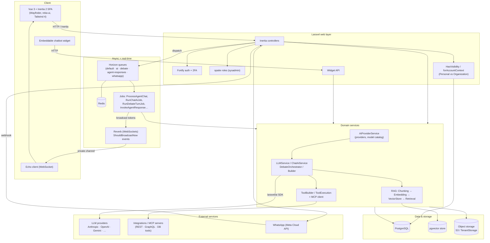
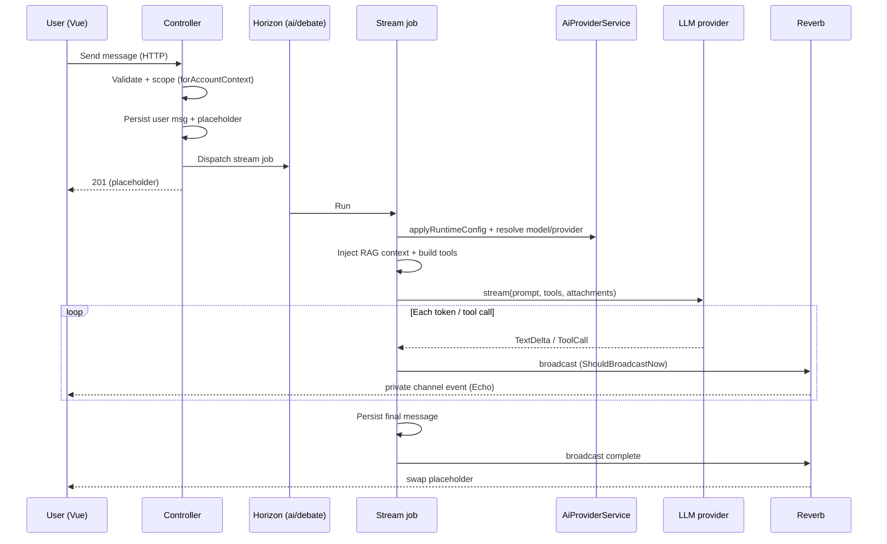

# Sapiensly — Architecture & Technical Reference

> A technical map of Sapiensly for AI assistants working on the codebase. Companion to
> `docs/sapiensly-features.md` (which is functional/product). This one covers the stack, the
> multi-tenant model, the data domains, the AI/RAG/tooling pipelines, real-time + queues, and the
> conventions to follow. It points at directories/components, not line numbers.

## Stack

- **PHP 8.4**, **Laravel** (`laravel/framework ^13`).
- **Inertia.js v2 + Vue 3** (`<script setup lang="ts">`), **Tailwind CSS v4** (CSS-variable
  theming, light/dark via `.dark`), **reka-ui / shadcn-vue** components.
- **Laravel Wayfinder** — type-safe routes; controllers/named routes are generated into
  `resources/js/actions/*` and `resources/js/routes/*` and imported in Vue.
- **AI:** `laravel/ai` SDK (LLM abstraction with tool calling, streaming, attachments).
- **Auth:** **Laravel Fortify** (registration, email/password login, two-factor, email
  verification, password reset — all rendered as Inertia pages). **Roles/permissions:**
  `spatie/laravel-permission` (e.g. the `sysadmin` role). Organizations are **native app
  models** (no external IdP / SSO).
- **Async:** Redis + **Laravel Horizon** (queues). **Real-time:** **Laravel Reverb** + Echo
  (WebSockets).
- **Data:** PostgreSQL + **pgvector** for embeddings/vector search.
- **Tooling:** Pest 4 (tests), Laravel Pint (PHP format), ESLint 9 + Prettier 3 (frontend),
  Laravel Boost (MCP dev server), Pail (logs).

## App structure

- **Backend:** controllers in `app/Http/Controllers/` (+ `Settings/`, `Admin/`, `Tools/`);
  form requests in `app/Http/Requests/<Domain>/`; domain services in `app/Services/` (with
  subfolders `Chat/`, `Debate/`, `Builder/`, `Manifest/`, `Records/`, `Storage/`, `Tools/`,
  `Workflows/`, `Integrations/`, `WhatsApp/`, `Admin/`, `Security/`); queued jobs in `app/Jobs/`;
  broadcast events in `app/Events/<Domain>/`; enums in `app/Enums/`.
- **Routes:** split per domain and `require`d from `routes/web.php` (e.g. `chat.php`,
  `debate.php`, `agents.php`, `standalone-agents.php`, `apps.php`, `flows.php`, `tools.php`,
  `knowledge-bases.php`, `documents.php`, `chatbots.php`, `system.php`, `whatsapp.php`,
  `admin.php`, `settings.php`, `auth.php`). WebSocket channel auth in `routes/channels.php`.
- **Frontend:** pages in `resources/js/pages/<group>/` (chat, debate, agents,
  standalone-agents, apps, flows, chatbots, documents, knowledge-bases, system, admin, settings,
  runtime, auth); shared chrome in `resources/js/components/app-v2/` (`Sidebar`, `Topbar`,
  `PageHeader`, `WorkspaceSwitcher`, `AgentsSwitcher`); layout `layouts/AppLayoutV2.vue`
  (`fullBleed` + `hideTopbar` + scoped slot for `openPalette`/`toggleSidebar`); i18n via
  `vue-i18n` with `resources/js/locales/{en,es}.json` (UI strings) and Laravel `lang/{en,es}.json`
  (server `__()` strings, e.g. enum labels).

## Multi-tenancy & access control

- Tenancy is **account-context based**, not separate databases by default. A user is in a
  **Personal** context (`organization_id = null`) or an **Organization** context.
- Tenant-owned models use the **`HasVisibility`** trait (`app/Models/Concerns/`):
  - `scopeForAccountContext($user)` — the canonical isolation scope: personal users see only
    their own org-less rows; org users see their own rows + rows shared with the org.
  - `scopeVisibleTo`, `isVisibleTo`, `updateVisibility`; `Visibility` enum =
    `Private | Organization | Global | Public`.
- IDs: most domain models use **`HasPrefixedUlid`** — string PKs like `agent_…`, `chat_…`,
  `dbt_…` (Debate), `tool_…`, `kb_…`. New models implement `getIdPrefix()`.
- Organizations are **native** (`Organization`, `OrganizationMembership`) and back the
  Personal⇄Organization workspace switching; platform roles come from
  `spatie/laravel-permission` (e.g. `sysadmin` gates the admin panel).
- **Always** scope tenant queries with `forAccountContext($user)` (or `visibleTo`) and authorize
  ownership in controllers/policies. Channel authorization verifies the owning user before
  letting a socket subscribe.

## Data domains (models)

Grouped by area (`app/Models/`):

- **Identity/tenancy:** `User`, `Organization`, `OrganizationMembership`.
- **AI config:** `AiProvider` (per-driver credentials + enabled models + default flags),
  `AiCatalogModel` (the global model catalog, seeded; capabilities `chat`/`embeddings`),
  `CloudProvider` (storage/database), `Integration` (+ `IntegrationEnvironment`,
  `IntegrationVariable`, `IntegrationRequest`, `IntegrationExecution`, `IntegrationUserToken`).
- **Agents:** `Agent` (type via `AgentType` enum: `general|triage|knowledge|action`; `HasVisibility`),
  `AgentTeam`, `Flow`. Pivots link agents to knowledge bases and tools.
- **Chat:** `Chat` (model, optional `agent_id`, tool ids, project; `mode` `single|multi_agent`
  and `synthesis_status` for @mention threads), `ChatMessage` (`agent_id`, `message_type`
  `text|action_proposal|action_result`, `agent_data_context`, `action_payload`), `ChatAttachment`,
  `ChatProject` (custom instructions + KB pivot), `ChatParticipant` (tenant table `chat_agents` —
  the @mention roster).
- **Debate:** `Debate`, `DebateParticipant` (model or `agent_id`), `DebateRound`, `DebateTurn`.
- **Knowledge/docs:** `KnowledgeBase`, `KnowledgeBaseDocument`, `KnowledgeBaseChunk` (pgvector),
  `Document`, `Folder`.
- **Apps (no-code):** `App`, `AppVersion`, `AppFile`, `AppSetting`, `Record`,
  `BuilderConversation`, `BuilderMessage`, `WorkflowRun`, `WorkflowStepRun`.
- **Conversations/agents runtime:** `Conversation`, `Message`, `Channel`, `Contact`.
- **Chatbots & widget:** `Chatbot`, `ChatbotAnalytics`, `ChatbotApiToken`, `WidgetSession`,
  `WidgetConversation`, `WidgetMessage`.
- **WhatsApp:** `WhatsAppConnection`, `WhatsAppConversation`, `WhatsAppMessage`,
  `WhatsAppTemplate`.
- **Tools:** `Tool` (type via `ToolType`: `rest_api|graphql|database|mcp|function|group`),
  `ToolGroupItem`.

## AI / LLM integration

- **`AiProviderService`** is the hub:
  - `getReachableChatModels($user)` — every chat model in the catalog for each driver the user
    has credentials for (used by Chat/Debate/Agent pickers).
  - `getAvailableModels` / `getModelCatalog` / `findModelInCatalog` / `getFullCatalog`.
  - `resolveProviderForCatalogModel($modelId, $user)` → `Lab` enum (provider) for SDK calls.
  - `applyRuntimeConfig($user)` — injects DB-stored provider credentials into the runtime config
    so the `laravel/ai` SDK can use them (call this in jobs before streaming).
- **SDK usage:** build an agent (`AnonymousAgent`, or thin subclasses `ChatAgent`/`DebateAgent`
  carrying `#[MaxTokens]`), then `->stream($prompt, attachments:, provider:, model:)` (iterate
  `TextStart`/`TextDelta`/`ToolCall` events) or `->prompt(...)` for one-shot. Attachments map to
  `StoredImage`/`StoredDocument`/`StoredAudio`.
  - **SDK quirk:** tools are named by `class_basename($tool)`, not a `name()` method — when
    several runtime tools could collide, wrap them in uniquely-named subclasses (see
    `RuntimeToolFactory`) and dedupe by final name.
- **Agent execution** (`app/Services/LLMService.php`): per type — Knowledge = RAG stream,
  Action = tool-calling, Triage = flow/routing, **General** = `chatWithKnowledgeAndTools()`
  (one call that injects RAG context **and** exposes the agent's tools). `ProcessAgentChat`
  (queue `ai`) drives agent conversations; `ChatStreamController` serves SSE for the agent chat
  page.

## RAG pipeline

- **`ChunkingService`** splits documents → **`EmbeddingService`** generates embeddings via the
  default embeddings provider → **`VectorStoreService`** (+ `VectorStoreSchema`) stores/searches
  vectors in pgvector, **always filtered by tenant** → **`RetrievalService::retrieve(query,
  kbIds, topK, threshold)`** returns `{context, chunk_count, knowledge_bases}`.
- `DocumentParserService` extracts text from uploads. `KnowledgeScopeWiper` cleans tenant vector
  data. Retrieved context is folded into the system prompt before the LLM call (Chat projects,
  Knowledge/General agents, agent debate participants).

## Tools

- **`ToolBuilderService::buildTools(Collection<Tool>)`** converts DB tools into SDK tool objects
  (`DynamicTool`), filtering to executable types (REST/GraphQL/Database). **`ToolExecutionService`**
  runs the call; **`ToolConfigService`** decrypts/serves config; MCP tools are expanded from each
  server's cached tool list and executed via `app/Services/Tools/McpClient` (Streamable HTTP
  JSON-RPC, OAuth where required, per-user tokens via `IntegrationUserToken`).
- Chat wraps selected tools in `RuntimeTool`/`RuntimeToolFactory` to give each a unique class
  name (SDK naming quirk) and adds provider-native `WebSearch` when enabled.

## Real-time & queues

- **Horizon supervisors** (`config/horizon.php`, Redis): `supervisor-default`, `supervisor-ai`
  (LLM/embeddings, 300s timeout), **`supervisor-debate`** (parallel debate turns),
  **`supervisor-agent-responses`** (sequential @mention agent turns), and the WhatsApp queues. Jobs
  declare their queue via `viaQueue()` (`ai`, `debate`, `agent-responses`, …). Restart Horizon
  after changing supervisors.
- **Streaming pattern:** a controller persists a placeholder + dispatches a job; the job streams
  from the SDK and broadcasts incremental events implementing **`ShouldBroadcastNow`** on a
  **private channel** (e.g. `chat.conversation.{id}`, `debate.{id}`), which the Vue page consumes
  via Echo. Events live in `app/Events/<Domain>/`; channel auth in `routes/channels.php` checks
  the owning user. Cooperative **stop** uses a cache flag the worker polls.
- **Debate orchestration** (`app/Services/Debate/`): `DebateOrchestrator` runs each round as a
  `Bus::batch` of `RunDebateTurnJob` (must be `Batchable`) on the `debate` queue; the batch's
  `finally` dispatches `AssessDebateRoundJob` (moderator consensus, tolerant JSON parse); on
  consensus or round limit it dispatches `SynthesizeDebateJob`. `DebateTurnStreamer` streams a
  single turn; agent participants get their prompt + RAG + tools injected.
- **Chat @mention orchestration** (`app/Services/Chat/`): when a message resolves agents
  (`MentionParser`), `MultiAgentDispatcher` rosters them (`chat_agents`) and dispatches a
  **`Bus::chain`** of `InvokeAgentResponse` (one per agent, **sequential** so each sees the prior
  replies) followed by `SynthesizeThread`, on the `agent-responses` queue. Each turn reuses
  `ChatAiService::streamAgentTurn` (the agent's prompt/model/RAG/tools/web-search), tagging the
  message with `agent_id` and snapshotting used sources into `agent_data_context`. `ThreadSynthesizer`
  produces a structured action proposal (`message_type=action_proposal`, normalized through
  `ActionRegistry` — v1 closes `manual`); `ActionExecutor` runs/dismisses it. New
  `ShouldBroadcastNow` events (`ChatAgentStarted`, `ChatActionProposalReady`, `ChatActionExecuted`)
  reuse the `chat.conversation.{id}` channel.

## No-code Apps (Builder + runtime)

- The **Builder** (`app/Services/Builder/`, `RunBuilderAiJob`) is an AI agent that edits an app's
  **manifest** (objects/pages/workflows) from a conversation; changes are proposed as builder
  messages you approve/reject/revert, with `AppVersion` snapshots. `app/Services/Manifest/`
  validates/applies the manifest; `app/Services/Records/` manages app data (`Record`);
  `app/Services/Workflows/` runs app workflows (`WorkflowRun`/`WorkflowStepRun`).
- The **runtime** serves a published app at public `/r/{slug}` URLs (pages, actions, uploads,
  file serving) — see the `runtime` page group. `BlockDataResolver` pre-resolves each block's
  data server-side via `RecordQueryService`.
- **Builder powers — conversational integrations & connected objects** (the platform leverage:
  users *author* connections by talking; nothing provider-specific is hand-coded). Builder LLM
  tools in `app/Ai/Tools/Builder/` extend the manifest-editing agent:
  - `discover_integration` / `create_integration` / `test_connection` (power #1) author + verify a
    per-tenant `Integration` in the conversation, backed by `App\Services\Builder\Integrations\IntegrationAuthoring`
    (composing `OAuth2DiscoveryService` + `IntegrationService` + `IntegrationCaller`). OAuth2
    discovery or api-key/bearer; the gate is authorization; secrets never reach the LLM.
  - `sample_endpoint` (power #2) fetches a real sample so the builder can infer a **connected
    object** — a manifest object with `source: connected` (integration_id + operation mapping +
    field_map). Authored through the normal `propose_change` loop.
  - **`App\Services\Integrations\IntegrationCaller`** is the shared authed + SSRF-guarded +
    token-refreshing call through an integration (used by both powers).
  - **Runtime read path:** `BlockDataResolver` branches per object source — a connected object's
    rows come from `App\Services\Connected\ConnectedObjectReader` (live external read via the
    integration), normalized to the same `{id, data}` shape as internal records, so tables/lists/
    charts render source-agnostically. **Passthrough**: external data is never stored; any future
    materialization is a tenant custom object under RLS, never a bespoke table.
  - See `docs/app-builder-connected-objects-design.md` and the power contracts in `docs/`.

## Storage & external infra

- **`app/Services/Storage/TenantStorage`** resolves the active object-storage disk (global S3 or
  a tenant `CloudProvider`); cloud uploads (chat attachments, app files) go there — never local.
- **`CloudProviderService`** can register a tenant Postgres connection at runtime (used by custom
  tables + the vector store) and supports test-connection + pgvector install. The
  `ResolveTenantConnection` middleware binds the tenant DB per request when configured.

## Conventions (follow these)

- **English** for all code, comments, commits, and docs. UI copy goes through i18n
  (`resources/js/locales/{en,es}.json`); Spanish is Mexican `tú`.
- PHP: constructor property promotion, explicit return types, curly braces always, PHPDoc over
  inline comments, Eloquent (avoid raw `DB::`), Form Request classes for validation, `config()`
  not `env()` outside config. Run **`vendor/bin/pint --dirty`** before finishing.
- Frontend: `<script setup lang="ts">`, single root element, Wayfinder for routes, reka-ui
  components, `cn()` for class merging; run **`npm run lint`** / **`npm run build`** (build also
  regenerates Wayfinder actions).
- **Testing is required** for every change (Pest). Feature tests dominate; Unit tests need
  explicit `uses(TestCase::class, RefreshDatabase::class)`. Fake the SDK with
  `Ai::fakeAgent(ClassName::class, [...])` (closure or array). The model catalog is seeded into
  the test DB. Outbound HTTP in tests should target `.invalid` hosts (Herd resolves `*.test` to
  localhost and the SSRF guard blocks them). Run `php artisan test --compact --filter=...`.

## How a request flows (typical AI feature)

1. Controller validates (Form Request), scopes by `forAccountContext`, creates a record +
   placeholder, and dispatches a queued job (returns immediately / Inertia).
2. The job calls `AiProviderService::applyRuntimeConfig`, resolves model+provider, optionally
   injects RAG context and builds tools, then streams from the SDK.
3. Each token/step is broadcast as a `ShouldBroadcastNow` event on a private channel; the Vue
   page (subscribed via Echo) appends it live; a final "complete" event swaps in the saved record.
4. Tenant data, files, and vectors are read/written through the workspace-scoped services
   (`forAccountContext`, `TenantStorage`, `VectorStoreService`).

---

## Architecture diagram

High-level component map:

AI streaming request lifecycle:

